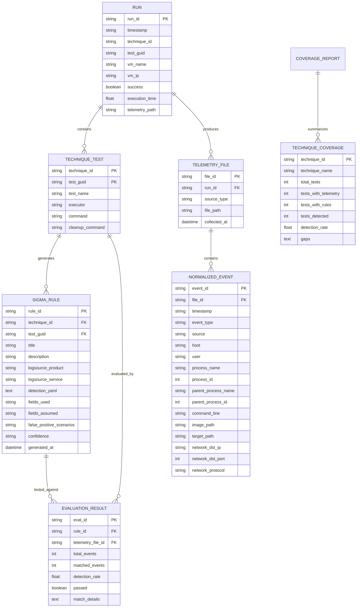

# Database Design: Purple Team Research Pipeline

## 1. Entity-Relationship Diagram



## 2. Table Definitions (Normalized to 3NF)

### 2.1 Run Metadata Table
```sql
CREATE TABLE runs (
    run_id          VARCHAR(8)     PRIMARY KEY,
    timestamp       TIMESTAMP      NOT NULL,
    technique_id    VARCHAR(20)    NOT NULL,
    test_guid       VARCHAR(36)    NOT NULL,
    vm_name         VARCHAR(100)   NOT NULL,
    vm_ip           VARCHAR(45)    NOT NULL,
    success         BOOLEAN        NOT NULL,
    execution_time  FLOAT          NOT NULL,
    telemetry_path  VARCHAR(500),
    created_at      TIMESTAMP      DEFAULT CURRENT_TIMESTAMP
);

CREATE INDEX idx_runs_technique ON runs(technique_id);
CREATE INDEX idx_runs_timestamp ON runs(timestamp);
```

### 2.2 Technique Test Table
```sql
CREATE TABLE technique_tests (
    technique_id    VARCHAR(20)    NOT NULL,
    test_guid       VARCHAR(36)    NOT NULL,
    test_name       VARCHAR(200)   NOT NULL,
    executor        VARCHAR(50)    NOT NULL,
    command         TEXT           NOT NULL,
    cleanup_command TEXT,
    PRIMARY KEY (technique_id, test_guid)
);
```

### 2.3 Telemetry Files Table
```sql
CREATE TABLE telemetry_files (
    file_id         UUID           PRIMARY KEY DEFAULT gen_random_uuid(),
    run_id          VARCHAR(8)     NOT NULL REFERENCES runs(run_id),
    source_type     VARCHAR(20)    NOT NULL,  -- sysmon, windows_event, edr_json, zeek
    file_path       VARCHAR(500)   NOT NULL,
    collected_at    TIMESTAMP      DEFAULT CURRENT_TIMESTAMP,
    file_size_bytes BIGINT
);

CREATE INDEX idx_telemetry_run ON telemetry_files(run_id);
CREATE INDEX idx_telemetry_source ON telemetry_files(source_type);
```

### 2.4 Normalized Events Table
```sql
CREATE TABLE normalized_events (
    event_id            UUID        PRIMARY KEY DEFAULT gen_random_uuid(),
    file_id             UUID        NOT NULL REFERENCES telemetry_files(file_id),
    timestamp           TIMESTAMP   NOT NULL,
    event_id_raw        VARCHAR(20) NOT NULL,
    event_type          VARCHAR(50) NOT NULL,
    source              VARCHAR(20) NOT NULL,
    host                VARCHAR(100),
    user                VARCHAR(100),
    process_name        VARCHAR(500),
    process_id          BIGINT,
    parent_process_name VARCHAR(500),
    parent_process_id   BIGINT,
    command_line        TEXT,
    image_path          VARCHAR(500),
    target_path         VARCHAR(500),
    network_dst_ip      VARCHAR(45),
    network_dst_port    INTEGER,
    network_protocol    VARCHAR(20),
    raw_event_json      JSONB,
    technique_tags      VARCHAR(20)[]
);

CREATE INDEX idx_events_timestamp ON normalized_events(timestamp);
CREATE INDEX idx_events_process ON normalized_events(process_name);
CREATE INDEX idx_events_type ON normalized_events(event_type);
CREATE INDEX idx_events_technique ON normalized_events(technique_tags);
```

### 2.5 Sigma Rules Table
```sql
CREATE TABLE sigma_rules (
    rule_id                 UUID        PRIMARY KEY DEFAULT gen_random_uuid(),
    technique_id            VARCHAR(20) NOT NULL,
    test_guid               VARCHAR(36) NOT NULL,
    title                   VARCHAR(200) NOT NULL,
    description             TEXT,
    logsource_product       VARCHAR(50),
    logsource_service       VARCHAR(50),
    detection_yaml          TEXT        NOT NULL,
    fields_used             VARCHAR(20)[],       -- observed in telemetry
    fields_assumed          VARCHAR(20)[],       -- inferred not verified
    false_positive_scenarios TEXT[],            -- concrete scenarios
    confidence              VARCHAR(10) NOT NULL CHECK (confidence IN ('high', 'low')),
    references              VARCHAR(200)[],
    tags                    VARCHAR(50)[],
    generated_at            TIMESTAMP   DEFAULT CURRENT_TIMESTAMP,
    UNIQUE (technique_id, test_guid)
);

CREATE INDEX idx_rules_technique ON sigma_rules(technique_id);
CREATE INDEX idx_rules_confidence ON sigma_rules(confidence);
```

### 2.6 Evaluation Results Table
```sql
CREATE TABLE evaluation_results (
    eval_id         UUID        PRIMARY KEY DEFAULT gen_random_uuid(),
    rule_id         UUID        NOT NULL REFERENCES sigma_rules(rule_id),
    telemetry_file_id UUID      NOT NULL REFERENCES telemetry_files(file_id),
    total_events    INTEGER     NOT NULL DEFAULT 0,
    matched_events  INTEGER     NOT NULL DEFAULT 0,
    detection_rate  FLOAT       NOT NULL DEFAULT 0.0,
    passed          BOOLEAN     NOT NULL DEFAULT FALSE,
    match_details   JSONB,
    evaluated_at    TIMESTAMP   DEFAULT CURRENT_TIMESTAMP
);

CREATE INDEX idx_eval_rule ON evaluation_results(rule_id);
CREATE INDEX idx_eval_telemetry ON evaluation_results(telemetry_file_id);
```

### 2.7 Coverage Report Table
```sql
CREATE TABLE coverage_reports (
    report_id       UUID        PRIMARY KEY DEFAULT gen_random_uuid(),
    technique_id    VARCHAR(20) NOT NULL,
    technique_name  VARCHAR(200) NOT NULL,
    total_tests     INTEGER     NOT NULL,
    tests_with_telemetry INTEGER NOT NULL,
    tests_with_rules INTEGER     NOT NULL,
    tests_detected  INTEGER     NOT NULL,
    detection_rate  FLOAT       NOT NULL,
    gaps            TEXT[],
    generated_at    TIMESTAMP   DEFAULT CURRENT_TIMESTAMP
);
```

## 3. File-Based Storage Schema (Current Implementation)

The pipeline uses a **file-based JSON/YAML store** in `data/` directory:

```
data/
├── telemetry/
│   └── <run_id>/
│       ├── manifest.json                    # TelemetrySession
│       ├── sysmon_<run_id>.evtx            # Raw Sysmon EVTX
│       ├── winevt_<run_id>/
│       │   ├── Security_<run_id>.evtx
│       │   ├── System_<run_id>.evtx
│       │   ├── Microsoft-Windows-Powershell_Operational_<run_id>.evtx
│       │   └── Microsoft-Windows-WMI_Operational_<run_id>.evtx
│       └── edr_<run_id>.jsonl              # EDR JSON Lines
├── rules/
│   ├── T1003.001_<guid>.yml                # Sigma rule YAML
│   ├── T1059.001_<guid>.yml
│   └── ...
└── evaluation/
    ├── eval_T1003.001_<guid>.json          # EvaluationResult
    ├── eval_T1059.001_<guid>.json
    └── coverage_report.json                # TechniqueCoverage[]
```

### 3.1 Manifest.json (TelemetrySession)
```json
{
  "session_id": "session_a1b2c3d4",
  "run_id": "a1b2c3d4",
  "vm_name": "win10-target",
  "start_time": "2026-10-06T10:00:00Z",
  "end_time": "2026-10-06T10:05:00Z",
  "collected_files": [
    "data/telemetry/a1b2c3d4/sysmon_a1b2c3d4.evtx",
    "data/telemetry/a1b2c3d4/winevt_a1b2c3d4/Security_a1b2c3d4.evtx",
    "data/telemetry/a1b2c3d4/edr_a1b2c3d4.jsonl"
  ]
}
```

### 3.2 Run Metadata (run_<id>_<tech>_<guid>.json)
```json
{
  "run_id": "a1b2c3d4",
  "timestamp": "2026-10-06T10:00:00Z",
  "technique_id": "T1003.001",
  "test_guid": "e4f5a6b7-c8d9-0123-4567-89abcdef0123",
  "vm_name": "win10-target",
  "vm_ip": "192.168.56.101",
  "success": true,
  "execution_time": 2.3,
  "telemetry_path": "data/telemetry/a1b2c3d4"
}
```

### 3.3 Sigma Rule (T1003.001_<guid>.yml)
```yaml
title: Detect OS Credential Dumping: LSASS Memory (T1003.001)
id: t1003.001_e4f5a6b7c8d90123456789abcdef0123
status: test
description: Detection for OS Credential Dumping: LSASS Memory based on observed telemetry from Atomic test e4f5a6b7-c8d9-0123-4567-89abcdef0123
references:
  - https://attack.mitre.org/techniques/T1003.001/
author: Purple Pipeline Auto-Drafter
date: 2026-10-06
modified: 2026-10-06
tags:
  - attack.credential_access
  - attack.t1003_001
logsource:
  product: windows
  service: sysmon
detection:
  selection:
    Image|endswith:
      - werfault.exe
      - comsvcs.dll
    CommandLine|contains:
      - -m 1 -p
  condition: selection
falsepositives:
  - Legitimate crash dump generation by WER
level: medium
confidence: low
fields_used:
  - process_name
  - command_line
fields_assumed:
  - target_path
```

### 3.4 Evaluation Result (eval_T1003.001_<guid>.json)
```json
{
  "rule_file": "data/rules/T1003.001_e4f5a6b7c8d90123456789abcdef0123.yml",
  "technique_id": "T1003.001",
  "test_guid": "e4f5a6b7c8d90123456789abcdef0123",
  "telemetry_file": "data/telemetry/a1b2c3d4/sysmon_a1b2c3d4.evtx",
  "total_events": 15,
  "matched_events": 3,
  "match_details": [
    {
      "timestamp": "2026-10-06T10:00:05Z",
      "event_id": "1",
      "event_type": "process_create",
      "process_name": "C:\\Windows\\System32\\werfault.exe",
      "command_line": "werfault.exe -m 1 -p 1234"
    }
  ],
  "detection_rate": 0.2,
  "passed": true
}
```

### 3.5 Coverage Report (coverage_report.json)
```json
[
  {
    "technique_id": "T1003.001",
    "technique_name": "OS Credential Dumping: LSASS Memory",
    "total_tests": 3,
    "tests_with_telemetry": 3,
    "tests_with_rules": 3,
    "tests_detected": 2,
    "detection_rate": 0.667,
    "rules": [
      "data/rules/T1003.001_e4f5a6b7c8d90123456789abcdef0123.yml",
      "data/rules/T1003.001_a2b3c4d5e6f7890123456789abcdef0123.yml",
      "data/rules/T1003.001_f1e2d3c4b5a69876543210fedcba9876.yml"
    ],
    "gaps": [
      "1 test(s) produced telemetry but no rule match",
      "HYPOTHESIS: Process injection (T1055) may need Sysmon Event ID 10 (ProcessAccess) - verify collection"
    ]
  }
]
```

## 4. Normalization & Integrity Rules

| Rule | Implementation |
|------|----------------|
| Every run has exactly one manifest | Enforced by `TelemetryCollector.stop_collection()` |
| Every technique test generates ≤1 rule | Enforced by `SigmaDrafter.save_rule()` (unique filename) |
| Evaluation requires both rule and telemetry | `RuleEvaluator.evaluate_all()` skips missing pairs |
| Coverage aggregates by technique_id | `CoverageAnalyzer.analyze()` groups by technique_id |
| Fields_used ⊆ actual event fields | `SigmaDrafter._analyze_fields()` only adds observed fields |
| Confidence = high only if events≥10 AND FP≤1 | `SigmaDrafter._assess_confidence()` hardcoded threshold |

## 5. Data Retention & Cleanup

| Data Type | Retention | Cleanup Policy |
|-----------|-----------|----------------|
| Telemetry EVTX/JSONL | 30 days (configurable) | `telemetry.retention_days` in config |
| Sigma Rules | Permanent | Manual cleanup |
| Evaluation Results | Permanent | Manual cleanup |
| Coverage Reports | Permanent | Manual cleanup |
| Run Metadata | Permanent | Manual cleanup |

## 6. Migration Path to Relational DB

If migrating to PostgreSQL:
1. Create tables per Section 2
2. Write ETL script: parse `data/` → INSERT into tables
3. Add foreign keys, indexes, constraints
4. Update `TelemetryNormalizer`, `RuleEvaluator`, `CoverageAnalyzer` to use SQLAlchemy
5. Keep file export for Sigma rules (SIEM import requirement)