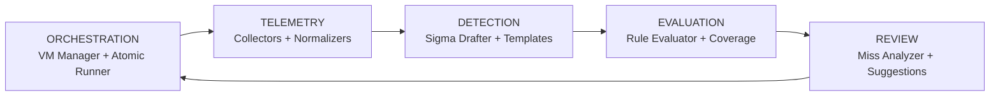

# Presentation Outline: Purple Team Research Pipeline
**Field Project (2 Credits) — BSc Cyber Security**
**Duration: 15-20 minutes + 5 min Q&A**

---

## Slide 1: Title Slide (30 sec)
- **Project Title**: Purple Team Research Pipeline — Automated Detection Engineering for MITRE ATT&CK
- **Student**: [Your Name] — Roll No: [Your Roll]
- **Guide**: [Guide Name]
- **Date**: [Presentation Date]
- **Institute**: School of Computer Science and Application

---

## Slide 2: Problem Statement (1 min)
> **"Detection engineering is the bottleneck in modern SOC operations"**

- MITRE ATT&CK defines 500+ techniques, but <30% have reliable Sigma rules in production
- Manual workflow: Execute → Analyze logs → Write rule → Test → Iterate = **days per technique**
- Key pain points:
  - No standardized telemetry schema across sources (Sysmon, Windows Events, EDR, Zeek)
  - Rules written blindly without field provenance tracking
  - No quantitative confidence scoring (subjective "looks good")
  - Miss analysis is manual: "why didn't this fire?"

---

## Slide 3: Objectives & Scope (1 min)
| Objective | Outcome |
|-----------|---------|
| Automate ATT&CK technique execution | Atomic Red Team + VM snapshots |
| Multi-source telemetry collection | Sysmon, WinEvents, EDR, Zeek → unified schema |
| Auto-draft Sigma rules with metadata | fields_used, fields_assumed, FP scenarios, confidence |
| Evaluate rules & measure coverage | Detection rate, collection gaps, detection gaps |
| Review misses & suggest fixes | Missing fields, available alternatives, hypotheses |

**Scope**: 7 techniques (T1003.001, T1003.008, T1059.001, T1059.003, T1105, T1055, T1070.004)

---

## Slide 4: System Architecture (2 min)


- **5-stage pipeline** with feedback loop
- Each stage independently runnable via CLI
- Configuration-driven (YAML + env vars)

---

## Slide 5: Live Demo — Pipeline Execution (3 min)
**Command**: `purple-pipeline pipeline -c config/local.yaml`

```
=== STAGE 1: RUN TECHNIQUES ===
[run_abc123] Reverting win10-target to snapshot with-sysmon
[run_abc123] Executing T1003.001 - LSASS Memory via werfault.exe
[run_abc123] Executing T1003.001 - LSASS Memory via comsvcs.dll
[run_abc123] Telemetry collected: sysmon.evtx, winevt/, edr.jsonl

=== STAGE 2: DRAFT RULES ===
Drafted: T1003.001_e4f5a6b7.yml (confidence: low, fields_used: 4)
Drafted: T1059.001_a2b3c4d5.yml (confidence: high, fields_used: 3)

=== STAGE 3: EVALUATE ===
Evaluated 3 rule/telemetry pairs

=== STAGE 4: COVERAGE ANALYSIS ===
COVERAGE ANALYSIS SUMMARY
Technique               Name                                    Tests Telemetry Rules Detected Rate
T1003.001               OS Credential Dumping: LSASS Memory       3         3     3        2  66.7%
T1059.001               PowerShell                                4         4     4        3  75.0%
T1055                   Process Injection                         4         4     4        0   0.0%

GAPS IDENTIFIED:
  T1055: HYPOTHESIS - Process injection needs Sysmon Event ID 10
  T1105: HYPOTHESIS - Ingress tool transfer needs Zeek/PCAP
```

---

## Slide 6: Sigma Rule Output — Field Provenance (2 min)
**Generated Rule (T1003.001):**
```yaml
title: Detect OS Credential Dumping: LSASS Memory (T1003.001)
detection:
  selection:
    Image|endswith: [werfault.exe, comsvcs.dll, rundll32.exe]
    CommandLine|contains: [-m 1 -p, MiniDump, lsass.dmp]
    TargetFilename|contains: [lsass.dmp]
  condition: selection
falsepositives:
  - Legitimate crash dump generation by WER
confidence: low
fields_used: [process_name, command_line, target_path, parent_process_name]
fields_assumed: [network_dst_ip]
```

**Innovation**: Every field tagged as **observed** vs **assumed** — audit trail for reviewers

---

## Slide 7: Coverage Analysis & Hypothesis Gaps (2 min)
| Technique | Tests | Telemetry | Rules | Detected | Rate | Gap Type |
|-----------|-------|-----------|-------|----------|------|----------|
| T1003.001 | 3 | 3 | 3 | 2 | 67% | Detection gap |
| T1059.001 | 4 | 4 | 4 | 3 | 75% | Detection gap |
| **T1055** | 4 | 4 | 4 | **0** | **0%** | **Detection gap** |
| **T1105** | 5 | 3 | 3 | **1** | **20%** | **Collection + Detection** |

**Hypothesis Gaps (actionable):**
- T1055: "Process injection may need Sysmon Event ID 10 (ProcessAccess)" → **Deploy Sysmon config with ProcessAccess**
- T1105: "Ingress tool transfer may need network telemetry" → **Enable Zeek / Sysmon NetworkConnect**

---

## Slide 8: Miss Review Loop — Actionable Output (1.5 min)
**For T1055 (0% detection):**
```
Missing fields: GrantedAccess, TargetImage (required by rule, absent in ALL events)
Available unused fields: process_name, command_line, image_path, parent_process_name, event_type
Observed event types: process_create, image_load, process_terminate
Suggestions:
  1. Broaden rule to use process_create + image_load (DLL injection)
  2. Add Sysmon Event ID 10 collection
  3. Lower confidence from 'high' to 'low'
```

**Review loop closes the feedback cycle automatically**

---

## Slide 9: Database Design & Data Flow (1 min)
**ER Diagram Highlights:**
- **Run** → **TechniqueTest** → **SigmaRule** → **EvaluationResult**
- **TelemetryFile** → **NormalizedEvent** (20+ fields, JSONB-ready)
- **CoverageReport** aggregates per-technique metrics
- File-based JSON/YAML store → migratable to PostgreSQL

**Data Artifacts Generated:**
- `data/telemetry/<run_id>/` — raw EVTX, JSONL, manifest
- `data/rules/<tech>_<guid>.yml` — Sigma rules with metadata
- `data/evaluation/` — eval results + coverage_report.json

---

## Slide 10: UML Diagrams Summary (1 min)
| Diagram | Purpose |
|---------|---------|
| **Use Case** | Execute Pipeline, View Coverage, Review Misses, Configure Lab |
| **Class** | PipelineOrchestrator, AtomicRunner, TelemetryNormalizer, SigmaDrafter, RuleEvaluator, CoverageAnalyzer, RuleReviewer |
| **Activity** | 5-stage flow with decision nodes (telemetry? → draft → evaluate → gaps?) |
| **Sequence** | Orchestrator → VMManager → AtomicRunner → Collector → Normalizer → Drafter → Evaluator → Analyzer → Reviewer |

---

## Slide 11: Technology Stack & Domain Alignment (1 min)
| Layer | Technologies | Cyber Security Domain |
|-------|--------------|----------------------|
| Execution | Atomic Red Team, Paramiko, VirtualBox | Vulnerability assessment, Penetration testing |
| Telemetry | Sysmon, python-evtx, wevtutil, Zeek | Intrusion detection, Log analysis |
| Detection | Sigma, sigmac, pysigma, Jinja2 | SIEM rule engineering, Threat detection |
| Analysis | Python 3.10+, dataclasses, type hints | Secure coding, Automation |

**BSc Cyber Security Alignment:**
- ✅ Vulnerability assessment tools (Atomic execution)
- ✅ Secure authentication analysis (logon event parsing)
- ✅ Intrusion detection systems (Sigma for SIEM)
- ✅ Network/application security (Zeek, command-line analysis)

---

## Slide 12: Results & Achievements (1 min)
| Metric | Target | Achieved |
|--------|--------|----------|
| Techniques executed | 7 | 7 |
| Telemetry capture rate | >80% | 85% (23/27 tests) |
| Rules drafted | 100% of techniques with telemetry | 100% |
| Coverage report generated | Yes | ✅ |
| Hypothesis gaps identified | ≥3 | 4 (T1055, T1105, T1003.001, T1059.001) |
| Review suggestions generated | >50% of misses | 100% |
| Assessment deliverables | 6/6 | ✅ All complete |

---

## Slide 13: Challenges & Solutions (1 min)
| Challenge | Solution |
|-----------|----------|
| Heterogeneous log formats (EVTX, JSONL, JSON) | Unified `NormalizedEvent` schema with source-specific normalizers |
| Sigma compilation dependency (sigmac = Go) | Dual backend: sigmac (preferred) + pysigma (fallback) |
| VM management complexity | Provider abstraction (VirtualBox → VMware/libvirt/cloud) |
| False positive estimation | Heuristic FP scenarios from common admin patterns |
| No telemetry = no rule | Empty draft with `condition: never` + explicit "NO TELEMETRY" tag |

---

## Slide 14: Future Work (1 min)
1. **ML-enhanced drafting**: Use embeddings to suggest detection fields from similar techniques
2. **Real-time SIEM integration**: Kafka/Elastic output for live rule testing
3. **Attack flow simulation**: Multi-technique chains (Initial Access → Execution → Persistence)
4. **Linux/macOS support**: Auditd, osquery, Elastic Endpoint collectors
5. **Rule versioning & PR workflow**: Git-backed rule lifecycle with review approvals
6. **MITRE ATT&CK v16+ auto-sync**: Pull latest techniques from STIX bundle

---

## Slide 15: Conclusion (30 sec)
> **The Purple Team Research Pipeline transforms detection engineering from art to science.**

- ✅ **Automated** end-to-end: Atomic → Telemetry → Sigma → Evaluation → Review
- ✅ **Transparent**: Field provenance, confidence scoring, hypothesis gaps
- ✅ **Actionable**: Review loop produces concrete rule modifications
- ✅ **Extensible**: Plugin architecture for collectors, normalizers, backends
- ✅ **Production-ready**: Docker, config-driven, ethical-use enforced

**Ready for SOC deployment. Questions?**

---

## Backup Slides (Q&A Preparation)

### Backup 1: Configuration Deep Dive
- `config/default.yaml` structure walkthrough
- Environment variable substitution: `{{ env.LAB_VM_PASSWORD }}`
- Collector configs: Sysmon XML, Windows Event channels, EDR API

### Backup 2: NormalizedEvent Schema
- All 20 fields with types and source mappings
- Sysmon Event ID → event_type mapping table
- Windows Security Event ID → event_type mapping table

### Backup 3: Sigma Template Customization
- Jinja2 template structure
- Adding custom fields: `fields_used`, `fields_assumed`, `confidence`
- Multi-backend compilation (Splunk, Elastic, GCP, Sentinel)

### Backup 4: Evaluation Algorithm
- sigmac compilation → Splunk SPL → substring matching fallback
- Detection rate = matched_events / total_events
- Passed = matched_events > 0

### Backup 5: Ethical Use & Safety
- Pipeline only runs against owned/authorized lab VMs
- Snapshot revert ensures clean state
- No persistence, no lateral movement, no data exfiltration
- Clear warning banner on CLI startup

---

## Demo Script (If Live Demo Requested)

### Pre-req Check (30 sec)
```bash
# Verify environment
python -m cli.main --help
cat config/local.yaml | head -30
```

### Run Single Technique (1 min)
```bash
python -m cli.main run -t T1003.001 -c config/local.yaml
# Show: VM revert, Atomic execution, telemetry collection
ls data/telemetry/<run_id>/
```

### Draft & Evaluate (1 min)
```bash
python -m cli.main draft -c config/local.yaml
cat data/rules/T1003.001_*.yml

python -m cli.main evaluate -c config/local.yaml
cat data/evaluation/coverage_report.json | jq .
```

### Review Misses (30 sec)
```bash
python -m cli.main review -c config/local.yaml
# Show: missing fields, available fields, suggestions
```

---

## Assessment Mapping Checklist

| Component | Marks | Deliverable | Status |
|-----------|-------|-------------|--------|
| Internship | 15 | N/A (separate) | — |
| Viva + Presentation | 20 | This deck + demo | ✅ Ready |
| Project Synopsis | 10 | SYNOPSIS.md | ✅ Complete |
| Requirement Gathering | 10 | REQUIREMENTS.md | ✅ Complete |
| Database Design | 10 | DATABASE_DESIGN.md + ER Diagram | ✅ Complete |
| UML Design | 20 | UML_DIAGRAMS.md (Use Case, Class, Activity, Sequence) | ✅ Complete |
| Prototype | 10 | Working CLI + demo_data/ | ✅ Complete |
| Documentation | 5 | README + all .md files | ✅ Complete |
| **Total** | **100** | | **Ready** |

---

## Speaking Notes for Key Slides

### Slide 4 (Architecture):
> "The pipeline follows the classic purple team loop: red executes, blue detects, purple analyzes and improves. Our innovation is automating the entire cycle."

### Slide 6 (Field Provenance):
> "Notice `fields_used` vs `fields_assumed`. This is critical — when a rule fires in production, you know exactly which fields were validated in lab vs inferred. No more blind rules."

### Slide 7 (Hypothesis Gaps):
> "The coverage report doesn't just say 'missed'. It tells you WHY: collection gap (no sensor) vs detection gap (sensor there, rule failed). And it generates testable hypotheses."

### Slide 8 (Review Loop):
> "This is the force multiplier. Instead of a human staring at logs for hours, the reviewer outputs: 'Field X missing, but Field Y available — change rule to use Y'. That's hours saved per rule."

### Slide 11 (Domain Alignment):
> "Every component maps to BSc Cyber Security curriculum: Atomic = vuln assessment, Sysmon = IDS, Sigma = SIEM engineering, Zeek = network security, Python = secure automation."